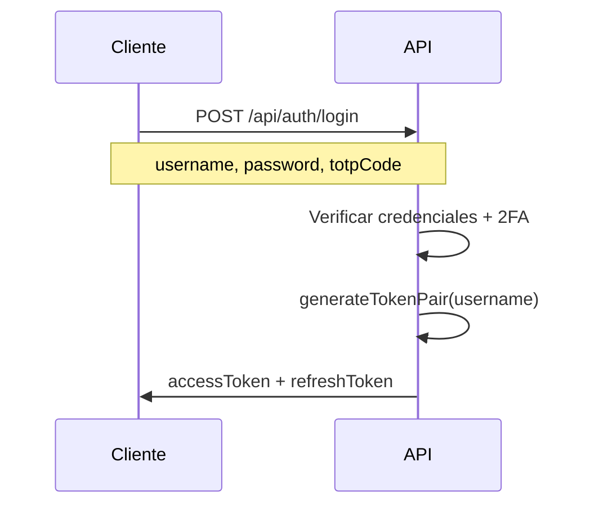
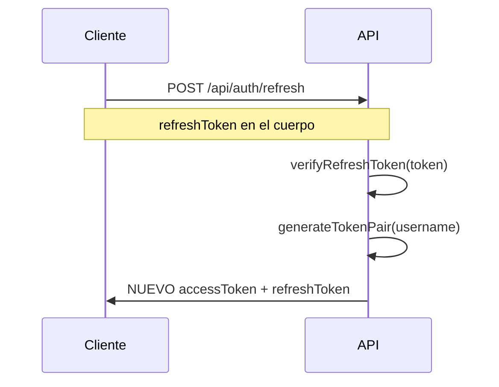
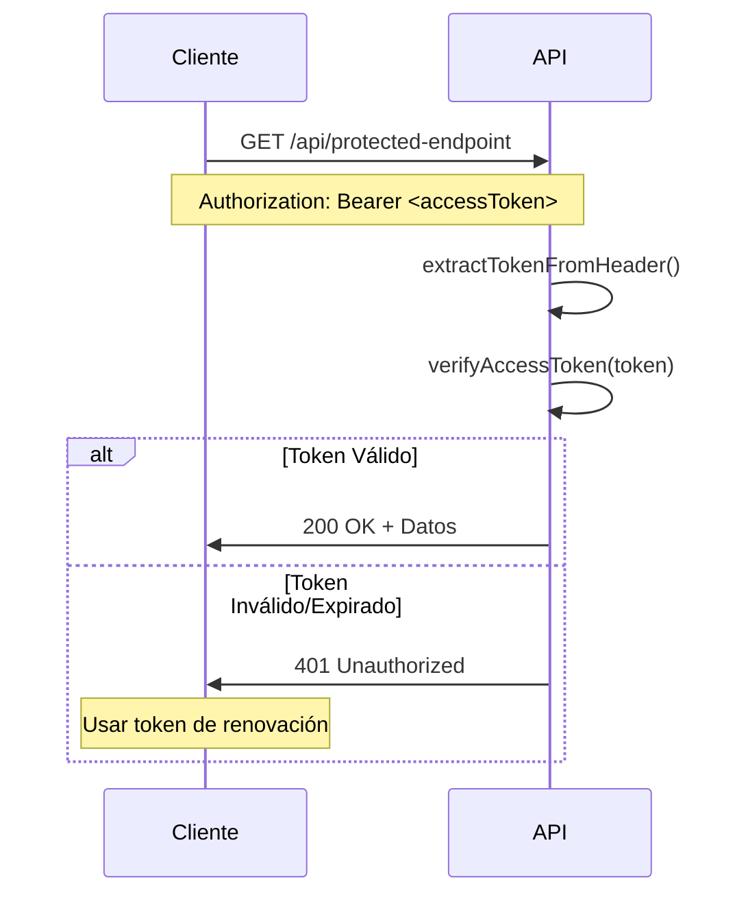

# Guía de Implementación JWT

> Guía completa para la implementación de JSON Web Tokens en este proyecto de API Next.js

## Resumen

Este proyecto implementa un **sistema JWT de doble token** con tokens de acceso y renovación para autenticación segura y sin estado. La implementación sigue las mejores prácticas de la industria con rotación adecuada de tokens y validación de tipos.

## Arquitectura

### JWTService (`/src/lib/auth/jwt.ts`)

La funcionalidad principal de JWT está centralizada en una clase estática `JWTService`:

```typescript
export class JWTService {
  static generateTokenPair(username: string): TokenPair
  static verifyAccessToken(token: string): JWTPayload
  static verifyRefreshToken(token: string): JWTPayload
  static extractTokenFromHeader(authHeader: string): string
}
```

**Características principales:**
- Utiliza la librería `jsonwebtoken` con algoritmo HS256 (predeterminado)
- Secreto único (`JWT_SECRET`) para todas las operaciones de token
- Validación de tipos previene el uso cruzado de tokens de acceso/renovación
- Diseño sin estado - no hay almacenamiento de tokens del lado del servidor

## Estructura de Tokens

### Payload JWT

Tanto los tokens de acceso como los de renovación comparten la misma estructura de payload:

```typescript
interface JWTPayload {
  username: string;      // Identificador del usuario
  type: 'access' | 'refresh';  // Validación del tipo de token
  iat: number;          // Emitido en (automático)
  exp: number;          // Expiración (automático)
}
```

### Tipos de Token

| Propiedad | Token de Acceso | Token de Renovación |
|-----------|-----------------|---------------------|
| **Propósito** | Autenticación de API | Renovación de token |
| **Duración** | 15 minutos | 7 días |
| **Uso** | Cada solicitud protegida | Solo para `/api/auth/refresh` |
| **Campo tipo** | `"access"` | `"refresh"` |

## Configuración de Entorno

### Variables Requeridas

```env
# Secreto JWT (Requerido)
JWT_SECRET=your-super-secret-jwt-key-change-this-in-production

# Expiración de token (Actualmente no usado - ver Problemas Conocidos)
JWT_EXPIRES_IN=1h
```

### Generación de Secreto

Genera un secreto JWT seguro usando el script proporcionado:

```bash
npm run generate:jwt-secret
```

Esto crea un secreto criptográficamente seguro de 512 bits (64 bytes).

**Importante**: El secreto generado debe almacenarse de forma segura y nunca ser incluido en el control de versiones.

## Duración y Temporización de Tokens

### Configuración Actual (Hardcodeada)

```typescript
// Token de Acceso: 15 minutos
expiresIn: '15m'

// Token de Renovación: 7 días  
expiresIn: '7d'
```

### Estrategia de Temporización

1. **Tokens de acceso de corta duración** (15min) minimizan la exposición si se comprometen
2. **Tokens de renovación de larga duración** (7d) reducen la re-autenticación frecuente
3. **Rotación de tokens**: Cada renovación genera un par de tokens completamente nuevo
4. **Expiración natural**: Los tokens se vuelven inválidos automáticamente después de la expiración

### Sincronización de Tiempo

⚠️ **Importante**: Asegurar que el tiempo del servidor esté sincronizado (NTP) para prevenir problemas de validación de tokens en sistemas distribuidos.

## Flujo de Autenticación

### Autenticación Inicial (`/api/auth/login`)



### Renovación de Token (`/api/auth/refresh`)



### Flujo de Solicitud Protegida



## Implementación de Seguridad

### Validación de Token

Cada endpoint protegido sigue este patrón:

```typescript
// 1. Extraer token del header Authorization
const authHeader = request.headers.get('authorization');
if (!authHeader || !authHeader.startsWith('Bearer ')) {
  return NextResponse.json({ error: 'Header de autorización faltante' }, { status: 401 });
}

// 2. Extraer y verificar token
const token = authHeader.substring(7);
try {
  const payload = JWTService.verifyAccessToken(token);
  // Token válido, proceder con la solicitud
} catch (error) {
  return NextResponse.json({ error: 'Token inválido' }, { status: 401 });
}
```

### Características de Seguridad

1. **Validación de Tipos**: Los tokens de acceso no pueden usarse como tokens de renovación y viceversa
2. **Expiración Automática**: Manejada por la librería `jsonwebtoken`
3. **Limitación de Velocidad**: Aplicada antes de la validación JWT para prevenir ataques de fuerza bruta
4. **Rotación de Tokens**: Cada renovación invalida el par de tokens anterior
5. **Validación de Header**: Enforza el formato apropiado de token `Bearer`

### Headers de Seguridad

Todos los endpoints protegidos por JWT incluyen headers de seguridad:

```typescript
// Ejemplo de headers de respuesta
'X-RateLimit-Limit': '5'
'X-RateLimit-Remaining': '4'  
'X-RateLimit-Reset': '1640995200'
```

## Manejo de Errores

### Errores Comunes de JWT

| Error | Estado HTTP | Causa | Solución |
|-------|-------------|-------|----------|
| `Missing authorization header` | 401 | No hay header `Authorization` | Agregar `Authorization: Bearer <token>` |
| `Invalid token format` | 401 | Formato de header incorrecto | Usar formato `Bearer <token>` |
| `Invalid token` | 401 | Token expirado/malformado | Usar token de renovación para obtener nuevo par |
| `Wrong token type` | 401 | Usar token de renovación para acceso API | Usar token de acceso para llamadas API |

### Formato de Respuesta de Error

```json
{
  "success": false,
  "error": "Token inválido",
  "message": "El token JWT proporcionado es inválido o ha expirado"
}
```

## Ejemplos de Integración

### Uso del Lado del Cliente

```javascript
// Almacenar tokens después del login
const { accessToken, refreshToken } = await loginResponse.json();
localStorage.setItem('accessToken', accessToken);
localStorage.setItem('refreshToken', refreshToken);

// Usar token de acceso para llamadas API
const response = await fetch('/api/protected-endpoint', {
  headers: {
    'Authorization': `Bearer ${accessToken}`,
    'Content-Type': 'application/json'
  }
});

// Manejar expiración de token
if (response.status === 401) {
  // Renovar tokens
  const refreshResponse = await fetch('/api/auth/refresh', {
    method: 'POST',
    body: JSON.stringify({ refreshToken }),
    headers: { 'Content-Type': 'application/json' }
  });
  
  if (refreshResponse.ok) {
    const { accessToken: newAccessToken } = await refreshResponse.json();
    // Reintentar solicitud original con nuevo token
  }
}
```

### Protección de Endpoint Backend

```typescript
export async function GET(request: NextRequest) {
  // Limitación de velocidad
  const clientIp = getClientIp(request);
  const rateLimitResult = rateLimiter.checkRateLimit(clientIp);
  
  if (!rateLimitResult.allowed) {
    return NextResponse.json({ error: 'Límite de velocidad excedido' }, { status: 429 });
  }

  // Validación JWT
  const authHeader = request.headers.get('authorization');
  if (!authHeader?.startsWith('Bearer ')) {
    return NextResponse.json({ error: 'Autorización inválida' }, { status: 401 });
  }

  try {
    const token = authHeader.substring(7);
    const payload = JWTService.verifyAccessToken(token);
    
    // Lógica protegida aquí
    return NextResponse.json({ 
      success: true, 
      user: payload.username,
      data: { /* tus datos */ }
    });
  } catch {
    return NextResponse.json({ error: 'Token inválido' }, { status: 401 });
  }
}
```

## Pruebas de Implementación JWT

### Pruebas Unitarias

El proyecto incluye pruebas exhaustivas para la funcionalidad JWT:

```bash
# Ejecutar pruebas JWT
npm test -- --testPathPattern=jwt

# Cobertura de pruebas
npm run test:coverage
```

### Pruebas Manuales

```bash
# 1. Login y obtener tokens
curl -X POST http://localhost:3000/api/auth/login \
  -H "Content-Type: application/json" \
  -d '{"username":"admin","password":"tu-contraseña","totpCode":"123456"}'

# 2. Usar token de acceso
curl -H "Authorization: Bearer <access-token>" \
  http://localhost:3000/api/demo/math?operation=add&a=1&b=2

# 3. Renovar tokens
curl -X POST http://localhost:3000/api/auth/refresh \
  -H "Content-Type: application/json" \
  -d '{"refreshToken":"<refresh-token>"}'
```

## Problemas Conocidos y Limitaciones

### Problemas Actuales

1. **⚠️ Variable de Entorno No Usada**: `JWT_EXPIRES_IN` está definida pero no se usa - las duraciones de token están hardcodeadas
2. **⚠️ Secreto Único**: El mismo secreto se usa para tokens de acceso y renovación
3. **⚠️ Sin Middleware Central**: La validación JWT está duplicada en todos los endpoints
4. **⚠️ Limitador de Velocidad en Memoria**: No es adecuado para despliegues distribuidos

### Mejoras Planificadas

- [ ] Hacer configurables los tiempos de expiración de tokens vía variables de entorno
- [ ] Implementar secretos separados para tokens de acceso y renovación
- [ ] Crear middleware de autenticación reutilizable
- [ ] Agregar limitación de velocidad basada en Redis para escalabilidad
- [ ] Implementar lista negra opcional de tokens para invalidación inmediata

## Mejores Prácticas

### Despliegue en Producción

1. **Gestión de Secretos**: Usar almacenamiento seguro de secretos (AWS Secrets Manager, etc.)
2. **Solo HTTPS**: Nunca transmitir tokens JWT sobre conexiones no cifradas
3. **Monitoreo**: Registrar eventos de autenticación para monitoreo de seguridad
4. **Rotación**: Rotar secretos JWT regularmente
5. **Sincronización de Tiempo**: Asegurar sincronización de tiempo del servidor entre instancias

### Seguridad del Lado del Cliente

1. **Almacenamiento Seguro**: Almacenar tokens en cookies httpOnly o localStorage seguro
2. **Limpieza de Tokens**: Limpiar tokens al cerrar sesión
3. **Renovación Automática**: Implementar renovación automática de tokens antes de la expiración
4. **Manejo de Errores**: Manejar escenarios de expiración de tokens de forma elegante

---

Para detalles de implementación, ver el código fuente en `/src/lib/auth/jwt.ts` y ejemplos de uso en los endpoints `/src/app/api/`.